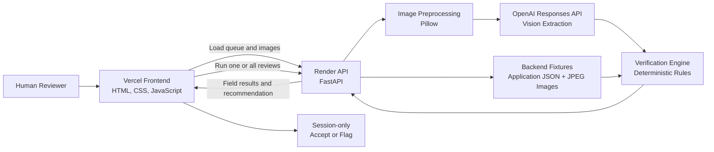

# TTB Label Reviewer

Review-focused proof of concept for comparing backend-provided TTB alcohol
application data with the visible text on its corresponding label image.

The backend currently simulates a database with five JSON/image fixtures. A
reviewer can run AI verification for one record or the full queue, inspect
field-level results, choose Accept or Flag, and submit that decision for the
current browser session.

Repository: https://github.com/Latrell23/latrell-price-ttb-label-verification-app

> **Cold-start notice:** The backend runs on Render's free tier and may spin
> down after a period of inactivity. The first request can take several minutes
> while the service starts. If the demo does not load immediately, wait and
> refresh the page; later requests should respond much faster.

## Live Demo

- Frontend: https://ttb-label-frontend.vercel.app/
- Backend health: https://latrell-price-ttb-label-verification-app.onrender.com/health
- Backend API base: https://latrell-price-ttb-label-verification-app.onrender.com

## Features

- Backend-fed queue with five simulated application and label-image records.
- AI review for one record or the entire queue.
- Field-level application-versus-image evidence with `PASS` or `FAIL` results.
- Overall `APPROVED` or `NEEDS_REVIEW` recommendation.
- Human Accept or Flag decision and session-only submission state.
- AI-read confidence and per-field match scores.
- Normalized fuzzy text, ABV, volume, country, and government-warning checks.
- Configurable bounded concurrency for full-queue review.
- Item-level failure handling so successful queue results are preserved.
- Responsive reviewer interface with readable status and error messages.

## Reviewer Workflow

1. The reviewer opens the app and loads a queue of backend-provided alcohol
   label applications.
2. The reviewer runs an AI review for one record or the entire queue.
3. The backend sends each label image to the OpenAI vision model and receives
   structured label data.
4. The verification engine compares the extracted values with the expected
   application data using field-specific rules.
5. The UI presents the source image, application values, extracted values,
   field-level results, an AI-read confidence indicator, and an overall
   `APPROVED` or `NEEDS_REVIEW` recommendation.
6. The human reviewer makes the final decision by selecting Accept or Flag and
   submitting the review for the current browser session.

AI assists with reading and comparison, but it does not make the final
regulatory decision.

## Design

The interface is designed as a focused review queue instead of a general data
entry tool. Each card keeps the label image, expected application data, AI
results, and reviewer actions together so the reviewer can make a decision
without moving between screens.

The design emphasizes:

- A clear visual hierarchy and large, readable controls.
- Plain-language status and error messages.
- Side-by-side evidence for every comparison.
- Visible human approval controls after the AI recommendation.
- Responsive layouts for desktop and smaller screens.
- Bounded queue concurrency so full-queue reviews remain reliable.
- Partial-result handling so one failed image or provider request does not
  discard successful reviews.

## Tech Stack

| Layer | Technology | Role |
| --- | --- | --- |
| Frontend | HTML5, CSS3, native JavaScript modules | Responsive reviewer interface and session state |
| Backend | Python 3.12, FastAPI, Uvicorn | Async API, routing, static image delivery, and application lifecycle |
| Data validation | Pydantic | Fixture, request, and response models |
| AI vision | OpenAI Responses API | Structured extraction of visible label fields |
| Image processing | Pillow, pillow-heif | Image validation, resizing, orientation, and JPEG preprocessing |
| Comparison | RapidFuzz and deterministic Python rules | Fuzzy text, numeric, unit, country, and exact-warning comparisons |
| Testing | Pytest, HTTPX | Unit, integration, API contract, concurrency, and error-path coverage |
| Deployment | Vercel and Render | Static frontend hosting and Python API hosting |

## Architecture



The browser contains the presentation layer and temporary reviewer-decision
state. FastAPI owns the review queue, label images, AI orchestration, validation,
and comparison logic. The OpenAI response is converted into a typed
`ExtractedLabel`, then compared with the fixture's `ApplicationData`.

The current proof of concept intentionally has no upload endpoint, manual
application form, production database, or persisted reviewer decisions.
Backend-owned JSON and image fixtures under `backend/app/review/fixtures`
simulate records that would later come from a database or upstream application
system.

Full-queue review uses configurable bounded concurrency. Every item returns its
own `completed` or `failed` status, allowing the UI to retain partial results
when an individual extraction fails.

The backend exposes only:

| Method | Path | Purpose |
| --- | --- | --- |
| `GET` | `/health` | Service and vision-configuration readiness |
| `GET` | `/review/labels` | Load the simulated review queue |
| `GET` | `/review/assets/{image}` | Serve fixture label images |
| `POST` | `/review/labels/{label_id}/verify` | Run AI review for one record |
| `POST` | `/review/verify` | Run AI review for the full queue |

## How I Built It With Codex

I used Codex as an implementation and review partner while keeping ownership of
the product direction. I began by giving Codex the overarching task: build a
reviewer-focused proof of concept that compares alcohol label images with
backend-provided application data and keeps a human reviewer in control of the
final decision.

From there, I broke the goal into smaller, verifiable tasks and directed Codex
as the project evolved:

1. Define the reviewer workflow, scope, data contract, and comparison rules.
2. Build the deterministic verification engine and its tests.
3. Integrate structured OpenAI vision extraction and image preprocessing.
4. Create the FastAPI review endpoints and simulated backend queue.
5. Build the accessible queue-based frontend and reviewer decision flow.
6. Add bounded concurrency, timeout handling, partial failures, and clear error
   states.
7. Review the implementation, run tests, fix issues, simplify the product
   scope, and prepare the Vercel and Render deployments.

For each task, I supplied the requirements and constraints, reviewed Codex's
output, and gave follow-up direction on behavior, usability, architecture, and
scope. The work followed a plan-review-execute loop: agree on the next small
goal, inspect the proposed or completed change, test it, and then use the
results to direct the next iteration.

This approach let me use Codex for implementation, debugging, documentation,
and code review without treating it as an unsupervised builder. Product
decisions, acceptance criteria, priorities, and final review remained
human-directed throughout the project.

## Local Setup

Create and start the backend:

```bash
cd backend
python3.12 -m venv .venv
source .venv/bin/activate
pip install -r requirements.txt
uvicorn app.main:app --host 0.0.0.0 --port 8000
```

In another terminal, serve the frontend:

```bash
cd frontend
python3 -m http.server 5173
```

Open `http://localhost:5173`.

Configure `frontend/config.js` for local development:

```js
window.APP_CONFIG = {
  API_BASE_URL: "http://localhost:8000",
  REVIEW_TIMEOUT_MS: 45000,
};
```

The committed configuration targets the deployed Render API. If you temporarily
change it to localhost, restore the deployed URL before publishing the Vercel
frontend:

```js
window.APP_CONFIG = {
  API_BASE_URL: "https://latrell-price-ttb-label-verification-app.onrender.com/",
  REVIEW_TIMEOUT_MS: 45000,
};
```

Backend environment variables:

| Variable | Required | Default | Purpose |
| --- | --- | --- | --- |
| `APP_ENV` | No | `local` | Selects local or production CORS defaults |
| `ALLOWED_ORIGINS` | Production | none | Comma-separated browser origins |
| `OPENAI_API_KEY` | Real AI review | none | OpenAI API credential |
| `OPENAI_MODEL` | Real AI review | none | Vision-capable model selected by the deployer |
| `OPENAI_REASONING_EFFORT` | No | none | Optional supported reasoning effort |
| `MAX_REVIEW_CONCURRENCY` | No | `3` | Maximum simultaneous queue review calls |
| `REVIEW_TIMEOUT_SECONDS` | No | `20` | Per-record backend AI time budget |

Example local backend environment:

```bash
export APP_ENV=local
export ALLOWED_ORIGINS=http://localhost:5173
export OPENAI_API_KEY=<your OpenAI API key>
export OPENAI_MODEL=<your vision-capable model>
export OPENAI_REASONING_EFFORT=<a supported effort value>
export MAX_REVIEW_CONCURRENCY=3
export REVIEW_TIMEOUT_SECONDS=20
```

Keep API keys in environment variables only. Never put credentials in
`frontend/config.js` or commit them to the repository.

## API Examples

Load the queue:

```bash
curl -sS http://localhost:8000/review/labels
```

Review one record:

```bash
curl -sS -X POST http://localhost:8000/review/labels/label-001/verify \
  -H 'Accept: application/json'
```

Review the full queue:

```bash
curl -sS -X POST http://localhost:8000/review/verify \
  -H 'Accept: application/json'
```

A completed item contains the fixture ID, image file name, status, and a
verification result. Failed queue items use the same stable error object without
preventing other records from completing.

Representative completed single-record response:

```json
{
  "client_id": "label-001",
  "file_name": "label-001.jpg",
  "status": "completed",
  "result": {
    "results": [
      {
        "field": "brand_name",
        "match_type": "FUZZY",
        "expected": "Acme Estate",
        "found": "ACME ESTATE",
        "status": "PASS",
        "match_score": 1.0
      }
    ],
    "overall_verdict": "APPROVED",
    "latency_ms": 842.1,
    "confidence_score": 1.0
  },
  "error": null
}
```

The full response contains one result for each of the seven compared fields.
The queue endpoint wraps these items with aggregate `passed`, `needs_review`,
`completed`, `failed`, and `total` counts plus total queue latency.

Expected endpoint-level failures use a stable error envelope. For example, an
unknown fixture ID returns HTTP `404`:

```json
{
  "error": {
    "code": "review_label_not_found",
    "message": "The requested review label was not found.",
    "details": [
      {
        "field": "label_id",
        "message": "Unknown label: label-999."
      }
    ]
  }
}
```

Review failures use stable codes including `invalid_image`,
`review_image_unavailable`, `vision_not_configured`,
`vision_extraction_failed`, `vision_result_unreadable`, and `internal_error`.
During a full-queue request, the error is attached to the failed item rather
than replacing successful results.

## Comparison Rules

Comparison logic lives in `backend/app/verification/engine.py`.

| Field | Strategy |
| --- | --- |
| `brand_name` | Normalized fuzzy text; threshold 90 |
| `class_type` | Normalized fuzzy text; threshold 90 |
| `producer` | Normalized fuzzy text; threshold 90 |
| `abv` | Numeric comparison within ±0.1 |
| `net_contents` | Unit-normalized comparison within ±1 mL |
| `country_of_origin` | Punctuation normalization and country synonyms |
| `government_warning` | Exact, case-insensitive comparison after whitespace normalization |

The overall verdict is `APPROVED` only when every field passes. Otherwise it is
`NEEDS_REVIEW`; the human reviewer still makes the final Accept or Flag decision.

## Verification

Run the backend suite:

```bash
backend/.venv/bin/pytest -q
```

Run focused comparison and review-route tests:

```bash
backend/.venv/bin/pytest -q backend/tests/test_verification.py
backend/.venv/bin/pytest -q backend/tests/test_review.py
backend/.venv/bin/pytest -q backend/tests/test_verification.py -k government_warning
```

Check frontend modules:

```bash
node --check frontend/js/app.js
node --check frontend/js/api.js
node --check frontend/js/constants.js
node --check frontend/js/rendering.js
node --check frontend/js/review.js
```

Run the deployed review-only smoke checklist:

```bash
backend/.venv/bin/python scripts/live_checklist.py \
  --base-url http://localhost:8000
```

Run a deterministic vision extraction without an OpenAI request:

```bash
backend/.venv/bin/python backend/scripts/run_vision_sample.py --mock
```

Run the same utility against OpenAI or pass an existing local image:

```bash
backend/.venv/bin/python backend/scripts/run_vision_sample.py
backend/.venv/bin/python backend/scripts/run_vision_sample.py /path/to/label.jpg
```

These direct vision utilities are development tools; they do not expose browser
upload APIs.

## Performance and Reliability

The review API preprocesses images to a maximum long edge of 1800 pixels at
JPEG quality 85 before vision extraction. A single review has a configurable
backend time budget, while queue-wide work is bounded by
`MAX_REVIEW_CONCURRENCY`. The browser uses its own longer timeout so the backend
can return completed and failed item results cleanly.

Run the repeatable direct-vision benchmark with the deterministic fake provider:

```bash
backend/.venv/bin/python backend/scripts/benchmark_phase6.py \
  --mock \
  --runs 3 \
  --jsonl /tmp/ttb-review-benchmark.jsonl
```

With OpenAI credentials configured, omit `--mock` to measure the selected
provider and model. Image preprocessing can also be evaluated with explicit
settings:

```bash
backend/.venv/bin/python backend/scripts/benchmark_phase6.py \
  --runs 30 \
  --max-edge 1800 \
  --jpeg-quality 85 \
  --jsonl /tmp/ttb-review-openai.jsonl
```

The benchmark reports preprocessing, model-request, and total latency
percentiles together with status, verdict, and error counts. Its current warm
single-label targets are:

| Measurement | Target |
| --- | --- |
| Total latency p50 | ≤ 3000 ms |
| Total latency p95 | ≤ 4500 ms |
| Total latency maximum | ≤ 5000 ms |
| Preprocessing p95 | ≤ 350 ms |
| Model request p95 | ≤ 4000 ms |

Historical measurements for the removed `/verify` upload endpoint are not
treated as current review-API results. Use `scripts/live_checklist.py` for the
deployed review-only contract and the benchmark above for fresh provider
latency measurements.

### Deployed Review API Snapshot

The following small smoke benchmark was recorded on July 27, 2026 against the
deployed Render review API. It is a point-in-time operational check, not a large
enough sample for a statistically meaningful p95.

| Measurement | Sample | Wall-clock result | API result |
| --- | ---: | ---: | --- |
| Initial health request | 1 | 0.560 s | HTTP 200 |
| First single-record AI review | 1 | 16.775 s | Completed in 9.998 s of reported API latency |
| Subsequent single-record AI reviews | 4 | 3.833 s median; 3.473–3.978 s range | All 4 completed without item errors |
| Full-queue AI review | 5 records | 7.985 s | 7.464 s reported API latency; 5 completed, 0 failed |

The health response shows that Render was already awake for this run, so the
16.775-second first AI review is not reported as a measured Render cold start.
It may include provider or model warm-up and network overhead. The full-queue
response returned one `APPROVED` and four `NEEDS_REVIEW` recommendations; all
five records completed and remained available for the human review step.

Reliability passed this sample, but the latency targets were not fully met: the
four-call warm median was above the 3-second p50 target, and the first AI call
was above the 5-second maximum target. More runs are needed before drawing a
stable p95 conclusion.
