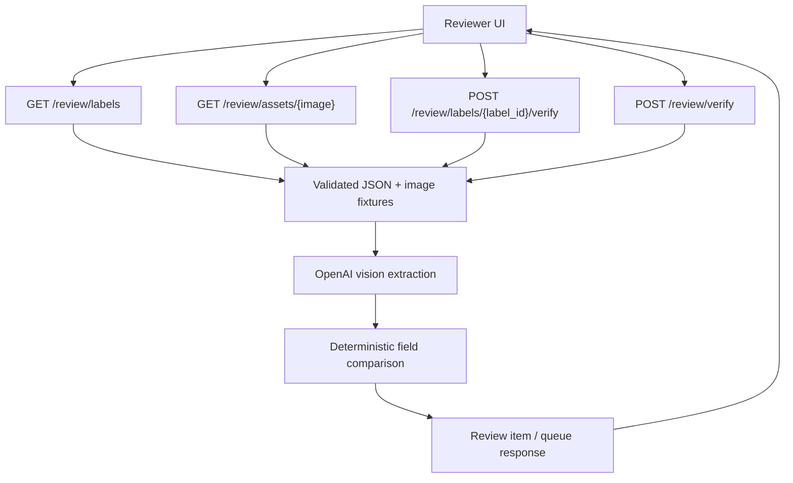

# Review Backend Flow

The full-queue endpoint processes fixture records concurrently up to
`MAX_REVIEW_CONCURRENCY`. Each item receives its own `completed` or `failed`
status, so one provider or image failure does not discard the rest of the queue.

Images and expected application data are backend-owned. The service does not
accept browser uploads or manually entered application values.
